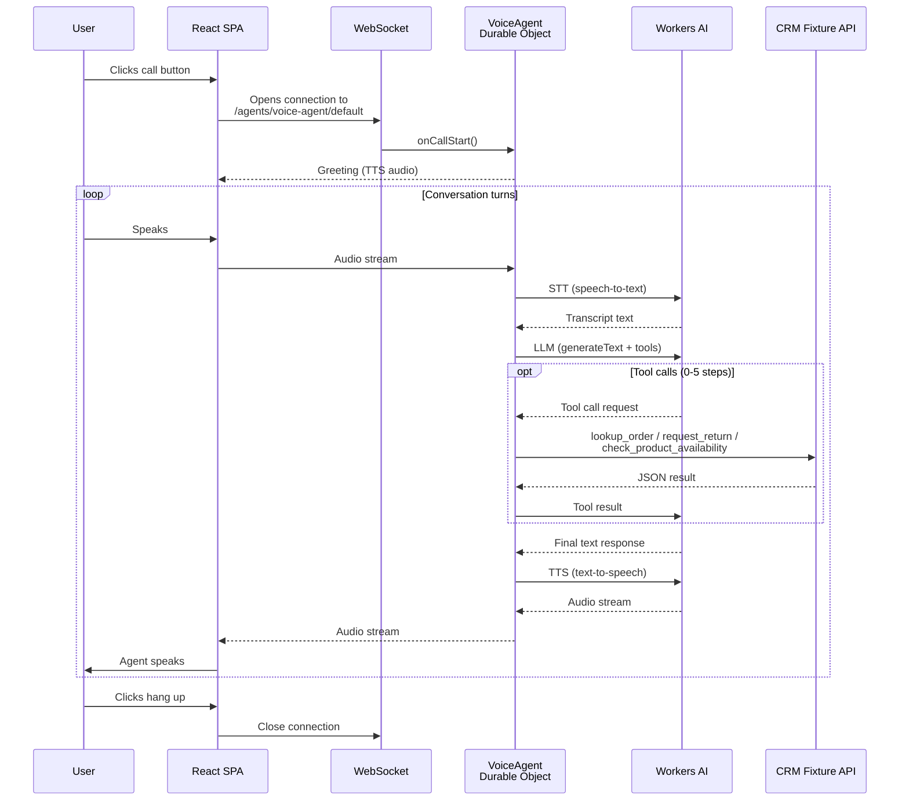

# Cloudflare Voice Agent Workshop Demo

A voice-powered customer support agent built on [Cloudflare Workers](https://developers.cloudflare.com/workers/) using the experimental [`@cloudflare/voice`](https://www.npmjs.com/package/@cloudflare/voice) SDK. Users speak to the agent in the browser and it responds with natural speech, backed by Workers AI for STT, LLM, and TTS.

The agent acts as a support rep for a fictional e-commerce store (Acme Inc.) and can look up orders, start returns, and check product availability using tool calling.

## Stack

- **Backend**: Cloudflare Workers + Durable Objects (`@cloudflare/voice`, `agents` SDK)
- **LLM**: Workers AI via [Vercel AI SDK](https://sdk.vercel.ai/) + [`workers-ai-provider`](https://www.npmjs.com/package/workers-ai-provider)
- **Frontend**: React 19 + Vite + [Cloudflare Vite plugin](https://www.npmjs.com/package/@cloudflare/vite-plugin)
- **Styling**: Tailwind CSS v4 (browser CDN, no build step)

## Prerequisites

- [Node.js](https://nodejs.org/) (v18+)
- [pnpm](https://pnpm.io/)
- A Cloudflare account with `wrangler login` completed (AI bindings always hit remote APIs, even locally)

## Getting Started

```sh
pnpm install
pnpm dev
```

This starts a local Vite dev server with Workers running via Miniflare. Open the URL shown in the terminal and click the phone button to start a voice call.

## Scripts

| Command           | Description                                                  |
| ----------------- | ------------------------------------------------------------ |
| `pnpm dev`        | Start local dev server                                       |
| `pnpm build`      | Type-check and build for production                          |
| `pnpm deploy`     | Build and deploy to Cloudflare                               |
| `pnpm lint`       | Run ESLint                                                   |
| `pnpm cf-typegen` | Regenerate `worker-configuration.d.ts` from `wrangler.jsonc` |

## Project Structure

```
worker/index.ts   # Workers entry point — VoiceAgent Durable Object + fetch handler
src/App.tsx       # React SPA — voice UI with useVoiceAgent hook
src/main.tsx      # React entry point
index.html        # HTML shell (includes Tailwind v4 CDN)
wrangler.jsonc    # Cloudflare Workers configuration
```

## How It Works



1. The React client uses `useVoiceAgent({ agent: "VoiceAgent" })` to open a WebSocket connection to the Durable Object.
2. The user's speech is streamed to the worker, where Workers AI transcribes it (STT).
3. The transcript is sent to the LLM (`@cf/google/gemma-4-26b-a4b-it`) with tools for order lookup, returns, and product search.
4. The LLM response is converted to speech (TTS) and streamed back to the browser.

## License

This project is provided as a workshop demo. Use it however you like.
